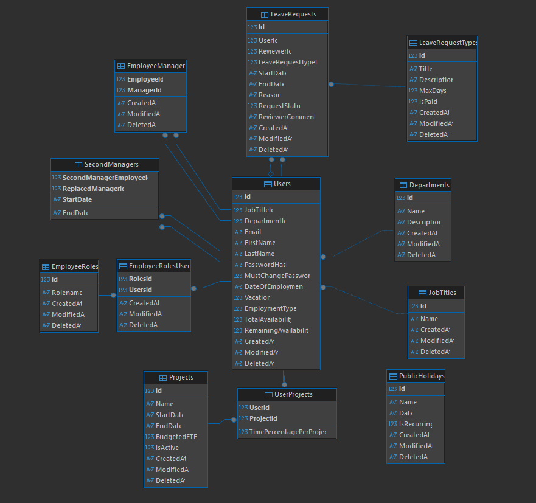

# Management Simulator 2025

Human resource management simulation application developed with modern technologies.

## 📋 Overview

Management Simulator 2025 is a full-stack web application for simulating and managing human resource processes, including authentication, user management, departments, projects, and leave requests.

## 🛠️ Technologies Used

### Frontend
- **Framework**: Angular 20.1.0
- **Styling**: TailwindCSS 4.1.11
- **Real-time Communication**: SignalR 8.0.7
- **CSV Processing**: PapaParse 5.5.3
- **Language**: TypeScript 5.8.2

### Backend
- **Framework**: ASP.NET Core (.NET 9.0)
- **ORM**: Entity Framework Core 9.0.7
- **Database**: SQLite
- **Authentication**: Cookie Authentication
- **Password Encryption**: BCrypt.Net-Next 4.0.2
- **Testing**: xUnit with Moq

## 🏗️ Project Architecture

### Backend - Onion/Clean Architecture

The backend project is structured into 5 main projects:

```
Backend/ManagementSimulator/
├── ManagementSimulator.API/          # Web API Layer
├── ManagementSimulator.Core/         # Business Logic Layer (Services)
├── ManagementSimulator.Database/     # Data Access Layer (Repositories & Entities)
├── ManagementSimulator.Infrastructure/ # Cross-cutting concerns (Config, Middleware)
└── ManagementSimulator.Tests/        # Unit Tests
```

**ManagementSimulator.API**
- Controllers for all REST endpoints
- Authentication and authorization configuration
- Error handling middleware
- CORS configuration for Angular integration

**ManagementSimulator.Core**
- Business logic services
- Request/Response DTOs
- Data transformation mappers
- Service interfaces

**ManagementSimulator.Database**
- Entity Framework entities
- Repositories for data access
- SQLite database context
- Migrations and data seeds

**ManagementSimulator.Infrastructure**
- Application configuration
- Custom middleware
- Custom exceptions
- Cross-cutting utilities

**ManagementSimulator.Tests**
- Unit tests for services
- Unit tests for repositories
- Test database configuration

### Frontend - Angular Architecture

The frontend is built with Angular 20.1.0 following modern Angular practices and component-based architecture:

```
Frontend/src/app/
├── components/           # UI components organized by user roles
│   ├── admin/           # Administration panel components
│   ├── manager/         # Manager dashboard components
│   ├── hr/              # HR management components
│   ├── user/            # User interface components
│   ├── shared/          # Reusable components across modules
│   └── auth/            # Authentication related components
├── services/            # Angular services for API communication
│   ├── core/            # Core business services
│   ├── auth/            # Authentication and authorization
│   └── data/            # Data management services
├── models/              # TypeScript interfaces and types
│   ├── entities/        # Domain entities
│   ├── dtos/            # Data transfer objects
│   └── enums/           # Enumeration types
├── guards/              # Route protection and navigation guards
├── interceptors/        # HTTP request/response interceptors
├── pipes/               # Custom Angular pipes for data transformation
├── utils/               # Utility functions and helpers
└── environments/        # Environment-specific configurations
```

**Frontend Architecture Principles**:
- **Modular Design**: Feature-based modules with clear separation of concerns
- **Component Hierarchy**: Smart/container components managing dumb/presentational components
- **Service Layer**: Centralized business logic and API communication
- **State Management**: Reactive patterns using RxJS observables
- **Type Safety**: Comprehensive TypeScript implementation with strict typing
- **Responsive Design**: Mobile-first approach using TailwindCSS
- **Real-time Communication**: SignalR integration for live updates
- **Security**: Route guards, authentication interceptors, and role-based access

## 🚀 Getting Started

### Prerequisites

- **.NET 9.0 SDK** - [Download here](https://dotnet.microsoft.com/download/dotnet/9.0)
- **Node.js 18+** - [Download here](https://nodejs.org/)
- **Angular CLI 20+** - `npm install -g @angular/cli`

### 1. Starting the Backend

```bash
# Navigate to backend directory
cd Backend/ManagementSimulator

# Restore NuGet packages
dotnet restore

# Run database migrations
dotnet ef database update --project ManagementSimulator.Database --startup-project ManagementSimulator.API

# Start the API application
dotnet run --project ManagementSimulator.API
```

The backend will be available at:
- **HTTP**: `http://localhost:5000`
- **HTTPS**: `https://localhost:7275`
- **Swagger UI**: `https://localhost:7275/swagger`

### 2. Starting the Frontend

```bash
# Navigate to frontend directory
cd Frontend

# Install dependencies
npm install

# Start development server
npm start
# or
ng serve

# For production build
ng build

# Run tests
ng test

# Run with specific port
ng serve --port 4201
```

The frontend will be available at: `http://localhost:4200`

**Frontend Development Features**:
- **Hot Reload**: Automatic browser refresh on code changes
- **Live Compilation**: TypeScript compilation in real-time
- **Error Display**: Compile errors shown in browser and console
- **Source Maps**: Full debugging support in browser DevTools
- **Proxy Configuration**: API calls proxied to backend automatically

### 3. Accessing the Application

After starting both servers:
1. Access `http://localhost:4200` in your browser
2. Use credentials created through seeds or create a new account
3. Navigate through the application based on user role

## 🗄️ Database

- **Type**: SQLite (for development)
- **Location**: `Backend/ManagementSimulator/ManagementSimulator.API/MGMTSimulator.db`
- **Schema**: See updated diagram in `Screenshots/dbSchemaV2.PNG`

### Database Schema

The database schema includes the following main entities and relationships:



**Main Entities:**
- **Users** - Central entity storing employee information, authentication data, and employment details
- **Departments** - Organizational units with name and description
- **JobTitles** - Employee positions and roles within the organization
- **LeaveRequests** - Employee leave applications with approval workflow
- **LeaveRequestTypes** - Different types of leave (vacation, sick, personal, etc.)
- **Projects** - Work projects with timelines and FTE allocations
- **EmployeeRoles** - System roles (Admin, Manager, HR, User) for authorization
- **PublicHolidays** - Company-wide holidays and non-working days

**Relationship Entities:**
- **EmployeeManager** - Many-to-many relationship between employees and their managers
- **EmployeeRoleUser** - Many-to-many relationship between users and their system roles
- **UserProject** - Many-to-many relationship between users and projects with time allocation
- **SecondManager** - Temporary manager assignments for coverage periods

### Seed Data

The project includes test data that can be activated in `Program.cs`:
```csharp
// Uncomment to populate database with test data
//SetupSeed.Seed(dbContext);
//PopulateSeed.Seed(dbContext);
```

## 🔐 Authentication System

### Features

- **Authentication**: Cookie-based authentication
- **Authorization**: Role-based (Admin, Manager, HR, User)
- **Password Reset**: Email verification code system
- **Password Security**: BCrypt hashing with salt
- **Sessions**: 12 hours with sliding expiration

### User Roles

1. **Admin** - Full CRUD access to all entities
2. **Manager** - Team and project management
3. **HR** - Leave request management and calendar
4. **User** - View own information and requests

## 🧪 Testing

```bash
# Run all unit tests
cd Backend/ManagementSimulator
dotnet test

# Run specific tests
dotnet test --filter "TestClassName"

# Run tests with coverage
dotnet test --collect:"XPlat Code Coverage"
```

## 📝 API Documentation

The API is documented using Swagger/OpenAPI:
- **Development**: `https://localhost:7275/swagger`
- **Main endpoints**:
  - `/api/auth/*` - Authentication
  - `/api/users/*` - User management
  - `/api/departments/*` - Departments
  - `/api/projects/*` - Projects
  - `/api/leaverequests/*` - Leave requests

## 🔧 Development Configuration

### Backend Configuration

Edit `Backend/ManagementSimulator/ManagementSimulator.API/appsettings.Development.json`:

```json
{
  "ConnectionStrings": {
    "MGMTSimulatorDb": "Data Source=MGMTSimulator.db"
  },
  "Logging": {
    "LogLevel": {
      "Default": "Information",
      "Microsoft.AspNetCore": "Warning"
    }
  }
}
```

### Frontend Configuration

**Environment Configuration**

Edit `Frontend/src/environments/environment.ts` for development:

```typescript
export const environment = {
  production: false,
  apiUrl: 'https://localhost:7275/api',
  signalrUrl: 'https://localhost:7275/hub'
};
```

Edit `Frontend/src/environments/environment.prod.ts` for production:

```typescript
export const environment = {
  production: true,
  apiUrl: 'https://your-api-domain.com/api',
  signalrUrl: 'https://your-api-domain.com/hub'
};
```

**Angular Configuration**

Key configuration files:
- `angular.json` - Angular CLI configuration
- `tsconfig.json` - TypeScript compiler options
- `package.json` - Dependencies and scripts
- `tailwind.config.js` - TailwindCSS configuration

**Proxy Configuration (Optional)**

Create `Frontend/proxy.conf.json` for API proxying:

```json
{
  "/api/*": {
    "target": "https://localhost:7275",
    "secure": true,
    "changeOrigin": true,
    "logLevel": "debug"
  }
}
```

Then run: `ng serve --proxy-config proxy.conf.json`

## 📊 Main Features

### 👑 For Administrators
**Backend Capabilities**:
- Complete CRUD operations for all entities
- User role and permission management
- System configuration and settings
- Advanced reporting and analytics

**Frontend Interface**:
- Comprehensive admin dashboard
- User management with bulk operations
- Department and job title configuration
- Manager-employee relationship assignment
- Leave type management with custom rules
- System statistics and usage reports
- CSV import/export for bulk operations

### 👨‍💼 For Managers
**Backend Capabilities**:
- Team member data access
- Leave request approval workflow
- Project assignment and tracking
- Team performance metrics

**Frontend Interface**:
- Team overview dashboard
- Leave request approval interface
- Project management tools
- Team calendar and availability view
- Employee performance tracking
- Direct team communication tools

### 🏢 For HR
**Backend Capabilities**:
- Company-wide leave management
- Holiday calendar configuration
- Employee availability tracking
- Compliance reporting

**Frontend Interface**:
- Interactive company calendar
- Leave request management dashboard
- Employee availability reports
- Holiday configuration panel
- Compliance and audit reports
- Bulk leave adjustments

### 👤 For Users
**Backend Capabilities**:
- Personal data management
- Leave request submission
- Request status tracking
- Personal calendar integration

**Frontend Interface**:
- Personal dashboard
- Leave request creation wizard
- Request history and status tracking
- Personal calendar with holidays
- Profile management
- Notification center

### 🌟 Cross-cutting Features
**Real-time Communication**:
- SignalR integration for live updates
- Instant notifications for approvals/rejections
- Real-time calendar updates
- Live project status changes

**Advanced UI/UX**:
- Responsive design for all devices
- Dark/light theme support (configurable)
- Advanced filtering and search
- Drag-and-drop interfaces
- Keyboard shortcuts
- Accessibility compliance (WCAG 2.1)

## 🤝 Contributing

To contribute to the project:
1. Fork the repository
2. Create a branch for the new feature
3. Implement changes
4. Add unit tests for new functionality
5. Create a Pull Request

## 📄 License

This project is licensed under the MIT License - see the [LICENSE](LICENSE) file for details.
